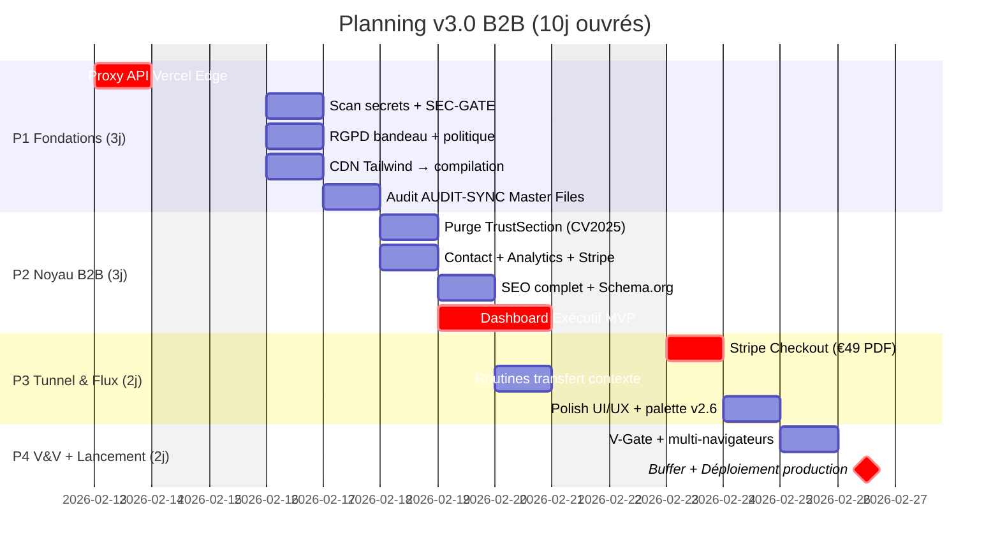
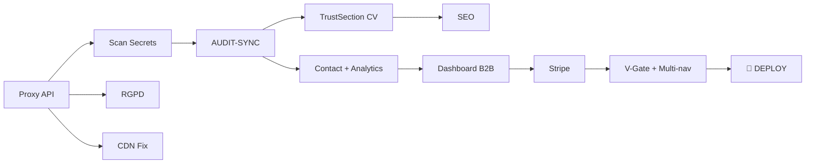

# 📅 PLANNING GANTT v3 : Aegis Circular v3.0 B2B

**Période** : 13 Février — 27 Février 2026 (**10 jours ouvrés**)  
**Commit de départ** : `c2c532b` (v2.6.0)  
**Objectif** : Production-ready v3.0 B2B

> [!WARNING]
> V3 intègre les éléments découverts dans les 86 fichiers d'archives (CDN Tailwind, tests multi-navigateurs, grille tarifaire Stripe).

---

## Diagramme

---

## Détail Jour par Jour

| Jour | Date | Phase | Tâches | Livrable |
|:--|:--|:--|:--|:--|
| J1 | **13/02 jeu** | P1 | Proxy API, retrait clé client | API sécurisée |
| J2 | **14/02 ven** | P1 | Scan secrets, RGPD, CDN Tailwind → local | Socle sécurité + perf |
| J3 | **17/02 lun** | P1 | Audit AUDIT-SYNC, sécurité rapport 11/02 | Alignement documentation |
| J4 | **18/02 mar** | P2 | TrustSection (CV2025), contact, Plausible.io | Crédibilité + mesure |
| J5 | **19/02 mer** | P2 | SEO complet, début Dashboard Exécutif | Visibilité + MVP B2B |
| J6 | **20/02 jeu** | P2 | Dashboard complet + grille tarifaire Stripe | Tunnel prêt |
| J7 | **21/02 ven** | P3 | Stripe Checkout, routines transfert IA | Conversion active |
| J8 | **24/02 lun** | P3 | Polish UI/UX, palette slate/navy v2.6 | Expérience premium |
| J9 | **25/02 mar** | P4 | V-Gate complet + tests multi-navigateurs | Rapport V&V |
| J10 | **26-27/02** | P4 | Buffer + corrections + déploiement Vercel | **🚀 v3.0 EN LIGNE** |

---

## Points d'Arbitrage

1. **Stripe** : intégrer maintenant (J7) ou reporter à v3.1 ?
2. **Dashboard Exécutif** : complet ou MVP simplifié ?
3. **Google Workspace** : maintenant ou post-lancement ?

---

## Dépendances

