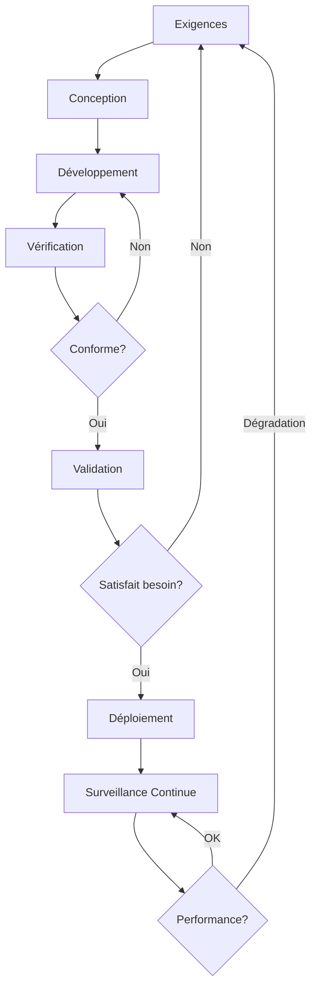
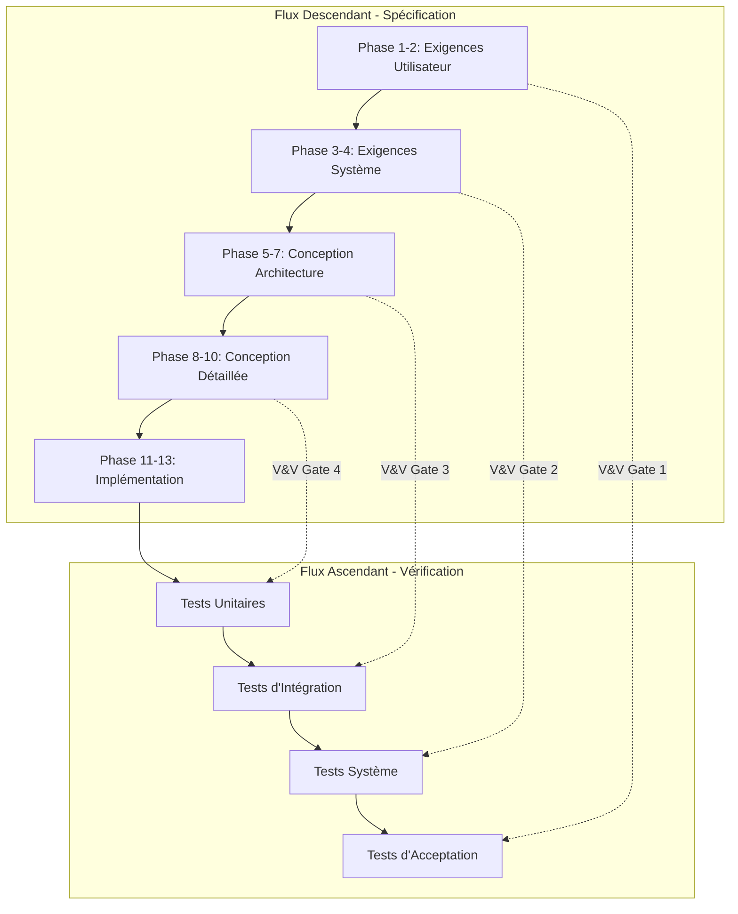

# Google Antigravity IDE
# Application Foundations Requirements & Specifications (AFRS)
# Master Document Template v2.0.1

**Date de création** : 15 janvier 2026  
**Dernière mise à jour** : 17 janvier 2026  
**Version** : 2.0.1  
**Auteur** : Jean-Pierre Charles avec Antigravity AI  
**Statut** : Template Générique  
**Domaine d'application** : Conception, vérification, optimisation et production d'applications industrielles conformes aux réglementations européennes

---

## Table des Matières

### [PARTIE I: CADRE MÉTHODOLOGIQUE](#partie-i-cadre-méthodologique)
1. [Standards et Références Normatives](#1-standards-et-références-normatives)
2. [Méthodologie d'Analyse Rationnelle](#2-méthodologie-danalyse-rationnelle)
3. [Processus de Vérification et Validation (V&V)](#3-processus-de-vérification-et-validation-vv)

### [PARTIE II: PROCESSUS DE DÉVELOPPEMENT EN 15 PHASES](#partie-ii-processus-de-développement-en-15-phases)
- [Phase 1: Définir une Phrase Claire - Ce Que C'est](#phase-1-définir-une-phrase-claire---ce-que-cest)
- [Phase 2: Définir l'Utilisateur, le Problème et le Job-to-be-Done](#phase-2-définir-lutilisateur-le-problème-et-le-job-to-be-done)
- [Phase 3: Verrouiller le MVP](#phase-3-verrouiller-le-mvp)
- [Phase 4: Rassembler 2–3 Produits de Référence](#phase-4-rassembler-23-produits-de-référence)
- [Phase 5: Mapper le Flux Utilisateur et États UI](#phase-5-mapper-le-flux-utilisateur-et-états-ui)
- [Phase 6: Planifier les Intégrations](#phase-6-planifier-les-intégrations)
- [Phase 7: Définir les Modèles de Données](#phase-7-définir-les-modèles-de-données)
- [Phase 8: Fixer un Objectif de Projet Strict](#phase-8-fixer-un-objectif-de-projet-strict)
- [Phase 9: Organiser les Clés API et Suivre l'Utilisation](#phase-9-organiser-les-clés-api-et-suivre-lutilisation)
- [Phase 10: Utiliser des Invites Structurées](#phase-10-utiliser-des-invites-structurées)
- [Phase 11: Changer une Chose par Itération](#phase-11-changer-une-chose-par-itération)
- [Phase 12: Déclarer ce qui ne Doit pas Changer](#phase-12-déclarer-ce-qui-ne-doit-pas-changer)
- [Phase 13: Définir les Agents avec Logs](#phase-13-définir-les-agents-avec-logs)
- [Phase 14: Retarder GitHub jusqu'à Stabilisation MVP](#phase-14-retarder-github-jusquà-stabilisation-mvp)
- [Phase 15: Checklist Finale Avant Lancement](#phase-15-checklist-finale-avant-lancement)
- [Phase 16: Amélioration Continue de l'Exactitude IA](#phase-16-amélioration-continue-de-lexactitude-ia)

### [PARTIE III: ANNEXES](#partie-iii-annexes)
- [Annexe A: Matrices de Conformité EU](#annexe-a-matrices-de-conformité-eu)
- [Annexe B: Templates Réutilisables](#annexe-b-templates-réutilisables)
- [Annexe C: Glossaire Technique](#annexe-c-glossaire-technique)

---

# PARTIE I: CADRE MÉTHODOLOGIQUE

---

## 1. Standards et Références Normatives

### 1.1 ISO/IEC/IEEE 29148:2018 - Requirements Engineering

> **"Systems and software engineering — Life cycle processes — Requirements engineering"**

Ce standard international définit les processus nécessaires à l'ingénierie des exigences tout au long du cycle de vie des produits logiciels et systèmes. Il a remplacé IEEE 830 en 2011.

#### Principes Clés Intégrés dans ce Template

| Principe | Description | Application dans AFRS |
|----------|-------------|----------------------|
| **Elicitation** | Identification et découverte des exigences | Phases 1-2: Vision et problème utilisateur |
| **Analyse** | Compréhension approfondie et classification | Phase 5: Flux utilisateur et analyse herméneutique |
| **Spécification** | Documentation formelle des exigences | Phases 7-8: Modèles de données et objectifs |
| **Validation** | Vérification de la complétude et cohérence | V&V gates entre chaque phase |
| **Gestion** | Traçabilité et contrôle des changements | Phases 11-12: Gestion du changement |

#### Attributs des Exigences (Section 5.2.5 de la norme)

Chaque exigence documentée doit posséder les attributs suivants :

- **Identifiant unique** : Traçabilité dans tout le cycle de vie
- **Priorité** : Must-have / Later / Not-yet (Phase 3)
- **Source** : Qui a exprimé cette exigence ?
- **Rationale** : Pourquoi cette exigence existe-t-elle ?
- **Critères de vérification** : Comment vérifier sa satisfaction ?
- **Stabilité** : Probabilité de changement
- **Dépendances** : Relations avec d'autres exigences

---

### 1.2 ISO/IEC 42001:2023 - AI Management Systems

> **Standard international pour les systèmes de gestion de l'intelligence artificielle**

#### Processus V&V Aligné (Annexe A, Contrôle A.6.2.4)



#### Distinction Vérification vs Validation

| Aspect | Vérification | Validation |
|--------|--------------|------------|
| **Question** | "Avez-vous construit le système **correctement** ?" | "Avez-vous construit le **bon** système ?" |
| **Focus** | Conformité aux spécifications | Satisfaction des besoins utilisateurs |
| **Méthodes** | Tests unitaires, revues de code, analyses statiques | Tests d'acceptation, retours utilisateurs, A/B testing |
| **Moment** | À chaque étape de développement | En fin de cycle et en production |
| **Critères** | Spécifications techniques | Objectifs métier et UX |

#### Obligations Spécifiques pour Systèmes IA

Si votre application intègre de l'IA (conformément à l'AI Act EU 2024/1689), vous devez :

1. **Traçabilité des données d'entraînement** : Provenance, gouvernance, analyse des biais
2. **Métriques de performance** : Précision, rappel, robustesse
3. **Surveillance humaine** : Mécanismes d'intervention et override
4. **Journalisation** : Rétention minimum 6 mois
5. **Tests de robustesse** : Adversarial testing, edge cases
6. **Documentation technique complète** : Architecture, limitations, usages interdits

---

### 1.3 Réglementations Européennes Applicables

#### 1.3.1 RGPD - Règlement (UE) 2016/679

**Applicable depuis** : 25 mai 2018  
**Sanctions** : Jusqu'à 4% du CA mondial ou 20M€

**Principes RGPD à intégrer dès la conception (Privacy by Design)** :

- Minimisation des données (Phase 7)
- Limitation des finalités (Phase 1-2)
- Exactitude et mise à jour (Phase 7)
- Limitation de conservation (Phase 7)
- Sécurité (Phase 9, 15)
- Transparence et consentement (Phase 5, 15)

**Droits des personnes à implémenter** :

- Droit d'accès (Art. 15)
- Droit de rectification (Art. 16)
- Droit à l'effacement / "droit à l'oubli" (Art. 17)
- Droit à la portabilité (Art. 20) - Format JSON ou CSV
- Droit d'opposition (Art. 21)
- Droit de retirer le consentement (Art. 7.3)

---

#### 1.3.2 Data Act - Règlement (UE) 2023/2854

**Applicable à partir de** : 12 septembre 2025  
**Domaine** : Données générées par les produits connectés et services IoT

**Obligations pour produits industriels** :

1. **Accès utilisateur aux données** : L'utilisateur d'un produit connecté doit pouvoir accéder facilement, en temps réel, aux données générées par ce produit
2. **Portabilité des données** : Transfert vers un fournisseur tiers dans un format structuré, couramment utilisé et lisible par machine
3. **Interopérabilité** : APIs ouvertes et standardisées (Phase 6)
4. **Clauses contractuelles équitables** : Interdiction des clauses abusives empêchant le partage de données

**Implémentation technique** (voir Phase 6 et 7) :

- APIs RESTful documentées
- Endpoints d'export de données (JSON, CSV)
- Catalogue de données disponibles
- Mécanismes de consentement pour partage tiers
- Protection des secrets d'affaires (filtrage des algorithmes propriétaires)

---

#### 1.3.3 AI Act - Règlement (UE) 2024/1689

**Entrée en vigueur progressive** : 2024-2027  
**Domaine** : Intelligence artificielle

**Pyramide des Risques** :

```
┌─────────────────────────────────────────────────────────┐
│                 PYRAMIDE AI ACT                         │
├─────────────────────────────────────────────────────────┤
│  🚫 RISQUE INACCEPTABLE (INTERDIT)                      │
│     - Notation sociale par l'État                        │
│     - Manipulation subliminale                           │
│     - Exploitation des vulnérabilités                    │
├─────────────────────────────────────────────────────────┤
│  ⚠️  HAUT RISQUE (OBLIGATIONS STRICTES)                 │
│     - Sécurité produits industriels (maintenance         │
│       prédictive, contrôle qualité)                      │
│     - Infrastructures critiques                          │
│     - Recrutement, éducation, crédit, forces de l'ordre │
├─────────────────────────────────────────────────────────┤
│  ⚡ RISQUE LIMITÉ (TRANSPARENCE OBLIGATOIRE)            │
│     - Chatbots (divulgation obligatoire)                │
│     - Génération de contenu (watermarking)              │
│     - Deepfakes (étiquetage)                            │
├─────────────────────────────────────────────────────────┤
│  ✅ RISQUE MINIMAL (PAS D'OBLIGATIONS SPÉCIFIQUES)      │
│     - Filtres anti-spam                                  │
│     - Recommandations produits                           │
└─────────────────────────────────────────────────────────┘
```

**Pour systèmes à haut risque** (Phase 13 - Agents IA) :

- Documentation technique complète (Annexe IV)
- Gestion des risques (Article 9)
- Gouvernance des données d'entraînement (Article 10)
- Journalisation (Article 12)
- Surveillance humaine (Article 14)
- Précision, robustesse, cybersécurité (Article 15)

---

#### 1.3.4 ERSP - Règlement (UE) 2024/1781

**Ecodesign Requirements for Sustainable Products**  
**Objectif** : Passeport numérique des produits (Digital Product Passport - DPP)

**Composants obligatoires du DPP** :

- **Identifiant Unique Produit** (UPI)
- **Traçabilité écosystémique** : Jumeaux numériques, nomenclature mécatronique, matériaux, logiciels embarqués
- **Empreinte carbone** : Cycle de vie complet
- **Circularité** : Recyclabilité, flux de matières

**Implémentation dans AFRS** (Phase 7 - Modèles de données) :

Si votre application gère des produits physiques, vous devez modéliser :

```typescript
interface DigitalProductPassport {
    upi: string; // Identifiant Unique Produit
    productInfo: {
        manufacturer: string;
        model: string;
        manufacturingDate: Date;
        serialNumber: string;
    };
    components: {
        mechanicalParts: Component[];
        electronics: Component[];
        software: SoftwareVersion[];
        materials: Material[];
    };
    sustainability: {
        carbonFootprint: number; // kg CO2eq
        recyclabilityRate: number; // %
        repairabilityIndex: number; // 0-10
        expectedLifespan: number; // années
    };
    traceability: {
        supplyChainSteps: SupplyChainEvent[];
        maintenanceHistory: MaintenanceRecord[];
        endOfLifePath: RecyclingRoute;
    };
}
```

---

#### 1.3.5 Machine Regulation - Règlement (UE) 2023/1230

**Domaine** : Sécurité des systèmes cyberphysiques mécatroniques intégrant l'IA

**Exigences essentielles de sécurité** :

- Analyse de risques selon ISO 12100
- Déclaration de conformité CE
- Dossier technique de construction
- Notice d'instructions
- Marquage CE

**Pour systèmes intégrant l'IA** (nouveau) :

- Documentation de l'IA embarquée
- Analyse des modes de défaillance liés à l'IA
- Protocoles de sécurité en cas de comportement imprévisible
- Formation des opérateurs à l'interaction homme-machine

---

#### 1.3.6 CRA - Règlement (UE) 2024/2847

**Cyber Resilience Act**  
**Domaine** : Cybersécurité des produits comportant des éléments numériques

**Exigences horizontales** :

1. **Secure by Design** : Sécurité dès la conception (Phase 7, 9)
2. **Gestion des vulnérabilités** : Processus de divulgation et patching
3. **Mises à jour de sécurité** : Updates réguliers pendant au moins 5 ans
4. **Documentation de cybersécurité** : Menaces, contrôles, architecture sécurisée
5. **SBOM** (Software Bill of Materials) : Liste de tous les composants logiciels

**Implémentation SBOM** (Phase 9) :

```json
{
  "bomFormat": "CycloneDX",
  "specVersion": "1.5",
  "version": 1,
  "components": [
    {
      "type": "library",
      "name": "react",
      "version": "19.0.0",
      "licenses": ["MIT"],
      "cpe": "cpe:2.3:a:facebook:react:19.0.0:*:*:*:*:*:*:*",
      "vulnerabilities": []
    }
  ]
}
```

---

## 2. Méthodologie d'Analyse Rationnelle

> [!IMPORTANT]
> **Obligation pour chaque phase du processus AFRS**
> 
> Conduire une analyse rationnelle structurée sur **trois dimensions complémentaires** :
> 1. Analyse herméneutique (le tout et ses parties)
> 2. Hiérarchie causale de Judea Pearl (3 niveaux)
> 3. Comportements utilisateurs non-prévus (edge cases)

---

### 2.1 Analyse Herméneutique : Le Tout et ses Parties

L'herméneutique est une méthode d'interprétation qui examine la relation dialectique entre le **tout** (le système global) et ses **parties** (les composants).

#### Principe du Cercle Herméneutique

```
     ┌─────────────────────────────────────┐
     │        COMPRÉHENSION DU TOUT        │
     │    (Vision globale du système)      │
     └──────────────┬──────────────────────┘
                    │
                    ├──────────► Informe la compréhension
                    │            des parties
                    ▼
     ┌─────────────────────────────────────┐
     │      COMPRÉHENSION DES PARTIES      │
     │   (Analyse des composants isolés)   │
     └──────────────┬──────────────────────┘
                    │
                    ├──────────► Enrichit la compréhension
                    │            du tout
                    ▼
           (Itération jusqu'à cohérence)
```

#### Application Pratique dans AFRS

**Étape 1 : Identifier le "Tout"**

Le "tout" est le système complet que vous construisez. Par exemple :
- Pour une plateforme de conformité : L'écosystème complet de gestion de compliance
- Pour un système de maintenance prédictive : L'ensemble du workflow de prédiction à intervention

**Étape 2 : Décomposer en "Parties"**

Les "parties" sont les sous-systèmes, fonctionnalités, composants :
- Modules fonctionnels (authentification, tableau de bord, export PDF, etc.)
- Acteurs (utilisateurs, administrateurs, APIs externes)
- Données (modèles, bases de données, fichiers)
- Processus (workflows, états, transitions)

**Étape 3 : Analyser les Relations**

- **Du tout vers les parties** : Comment la vision globale influence-t-elle chaque composant ?
  - Ex: Si la vision est "conformité à vie du produit", alors chaque module doit supporter la traçabilité temporelle
- **Des parties vers le tout** : Comment les contraintes des composants impactent-elles le système global ?
  - Ex: Si l'API externe a une limite de débit, le système global doit implémenter une file d'attente

**Étape 4 : Rechercher les Incohérences**

- Les parties isolées sont-elles cohérentes avec le tout ?
- Le tout émergent des parties est-il conforme à la vision initiale ?
- Y a-t-il des contradictions à résoudre ?

#### Template d'Analyse Herméneutique

```markdown
## Analyse Herméneutique - [Nom de la Phase]

### Le Tout (Vision Globale)
- **Description** : [Qu'est-ce que le système complet ?]
- **Objectifs principaux** : [Finalités]
- **Contraintes globales** : [Limitations, réglementations]

### Les Parties (Composants)
1. **[Partie 1]**
   - Rôle dans le tout :
   - Contraintes spécifiques :
   - Dépendances :

2. **[Partie 2]**
   - ...

### Relations Tout ↔ Parties
- **Du tout vers les parties** : Comment la vision influence les composants ?
- **Des parties vers le tout** : Comment les composants modifient la vision ?

### Incohérences Détectées
- [ ] [Incohérence 1] → Résolution :
- [ ] [Incohérence 2] → Résolution :

### Synthèse
[Conclusion de l'analyse herméneutique]
```

---

### 2.2 Hiérarchie Causale de Judea Pearl

**Judea Pearl**, prix Turing 2011, a défini 3 niveaux de raisonnement causal nécessaires pour comprendre les systèmes complexes.

#### Les 3 Échelons de la Causalité

```
┌────────────────────────────────────────────────────────────┐
│  NIVEAU 3: CONTREFACTUEL (Imaginer / Raisonner)           │
│  "Qu'est-ce qui se serait passé si... ?"                  │
│  ► Capacité : Imagination, attribution de responsabilité  │
│  ► Données : Modèle causal structurel complet             │
│  ► Exemple : "Si j'avais implémenté l'authentification    │
│              multi-facteurs, l'attaque aurait-elle réussi?"│
└────────────────────────────────────────────────────────────┘
                            ▲
                            │ Requiert
                            │
┌────────────────────────────────────────────────────────────┐
│  NIVEAU 2: INTERVENTION (Faire / Expérimenter)            │
│  "Que se passerait-il si je faisais X ?"                  │
│  ► Capacité : Prédire l'effet d'actions, A/B testing      │
│  ► Données : Expérimentations ou graphe causal            │
│  ► Exemple : "Si j'ajoute un champ au formulaire,         │
│              le taux de conversion va-t-il baisser ?"     │
└────────────────────────────────────────────────────────────┘
                            ▲
                            │ Requiert
                            │
┌────────────────────────────────────────────────────────────┐
│  NIVEAU 1: ASSOCIATION (Voir / Observer)                  │
│  "Qu'est-ce qui est corrélé ?"                            │
│  ► Capacité : Détecter des patterns, tendances            │
│  ► Données : Observations passives, statistiques          │
│  ► Exemple : "Les utilisateurs qui abandonnent le         │
│              formulaire ont en moyenne 3+ champs vides"   │
└────────────────────────────────────────────────────────────┘
```

#### Application dans le Développement Logiciel

##### Niveau 1 : Association (Observation)

**Quand l'utiliser** :
- Analyse des données utilisateurs existantes
- Identification de patterns dans les logs
- Étude des corrélations entre métriques

**Exemples de questions** :
- Quels parcours utilisateurs mènent à l'abandon ?
- Quelles fonctionnalités sont les plus utilisées ?
- Y a-t-il une corrélation entre temps de chargement et taux de rebond ?

**Limites** : L'association ne prouve PAS la causalité. "Les utilisateurs qui utilisent la fonctionnalité X achètent plus" ne signifie pas que X cause les achats.

##### Niveau 2 : Intervention (Expérimentation)

**Quand l'utiliser** :
- Conception de nouvelles fonctionnalités
- Tests A/B
- Validation d'hypothèses causales

**Exemples de questions** :
- Si je simplifie le processus d'inscription, est-ce que plus d'utilisateurs vont s'inscrire ?
- Si je change la couleur du bouton CTA, est-ce que le taux de clic va augmenter ?
- Si j'ajoute une aide contextuelle, est-ce que les erreurs vont diminuer ?

**Opérateur do(X)** : Pearl utilise la notation do(X) pour distinguer "observer X" de "forcer X"
- P(Y | X) : Probabilité de Y sachant qu'on a observé X (association)
- P(Y | do(X)) : Probabilité de Y si on impose X (intervention)

##### Niveau 3 : Contrefactuel (Raisonnement)

**Quand l'utiliser** :
- Post-mortem d'incidents
- Attribution de causalité
- Analyse de scénarios alternatifs
- Planification de contingence

**Exemples de questions** :
- Si j'avais déployé le hotfix plus tôt, est-ce que l'incident aurait été évité ?
- Est-ce le manque de validation qui a causé la faille de sécurité ?
- Qu'est-ce qui se serait passé si on avait choisi MongoDB au lieu de PostgreSQL ?

**Importance** : Le niveau contrefactuel est essentiel pour :
- Apprendre des erreurs (véritable apprentissage causal)
- Responsabilité et éthique (qui/quoi a causé le problème ?)
- Planification robuste (anticiper les effets de décisions alternatives)

#### Template d'Analyse Pearl (3 Niveaux)

```markdown
## Analyse Causale (Pearl) - [Nom de la Phase/Décision]

### Niveau 1 : Association (Observations)
**Données disponibles** :
- [Source de données 1]
- [Source de données 2]

**Patterns observés** :
- Observation 1 : [Description]
- Observation 2 : [Description]

**Corrélations identifiées** :
- Métrique A ↔ Métrique B : [Coefficient de corrélation]

⚠️ **Attention** : Ces corrélations ne prouvent PAS la causalité.

---

### Niveau 2 : Intervention (Prédictions d'Actions)
**Hypothèses causales à tester** :
1. Si [Action X], alors [Effet attendu Y]
   - Raisonnement : [Pourquoi pensons-nous que X cause Y ?]
   - Méthode de test : [A/B test, prototype, simulation]
   - Critère de succès : [Métrique mesurable]

2. Si [Action W], alors [Effet attendu Z]
   - ...

**Plan d'expérimentation** :
- [ ] Définir groupe contrôle et groupe test
- [ ] Mesurer métriques pré-intervention
- [ ] Appliquer intervention
- [ ] Mesurer métriques post-intervention
- [ ] Analyser significance statistique

---

### Niveau 3 : Contrefactuel (Scénarios Alternatifs)
**Question centrale** : "Qu'est-ce qui se serait passé si... ?"

**Scénario contrefactuel 1 :**
- Réalité observée : [Ce qui s'est passé]
- Alternative hypothétique : [Ce qui aurait pu se passer si décision différente]
- Conséquences probables : [Analyse]
- Responsabilité causale : [Quelle décision/facteur a causé la réalité observée ?]

**Scénario contrefactuel 2 :**
- ...

**Leçons apprises** :
- [Insight 1]
- [Insight 2]

**Application aux décisions futures** :
- [Comment cette analyse informe les choix à venir ?]
```

---

### 2.3 Analyse des Comportements Utilisateurs Non-Prévus

> [!WARNING]
> **Obligation critique**
> 
> Les spécifications initiales décrivent généralement le "happy path" (chemin nominal). Cependant, **la majorité des bugs et problèmes UX proviennent de comportements utilisateurs non anticipés**.

#### Catégories de Comportements Non-Prévus

| Catégorie | Description | Exemples |
|-----------|-------------|----------|
| **Erreurs involontaires** | L'utilisateur se trompe sans le vouloir | Saisie de caractères invalides, clic sur mauvais bouton |
| **Exploration** | L'utilisateur teste les limites | Clic rapide répété, retour arrière, rafraîchissement |
| **Contournement** | L'utilisateur cherche un raccourci | Modifier l'URL directement, devtools, copier-coller |
| **Hostile/Malveillant** | L'utilisateur essaie de casser | Injection SQL, XSS, CSRF, fuzzing |
| **Contexte dégradé** | Conditions environnementales imprévues | Réseau lent/intermittent, batterie faible, multitâche |
| **Accessibilité** | Utilisateurs avec besoins spéciaux | Navigation clavier only, lecteurs d'écran, daltonisme |

#### Méthodologie : "Red Team" Thinking

**Principe** : Au lieu de penser "Comment l'utilisateur DOIT utiliser le système ?", pensez "Comment l'utilisateur PEUT casser le système ?"

**Exercice pratique pour chaque fonctionnalité** :

1. **Identifier le happy path** : Scénario nominal documenté
2. **Lister 10 façons de dévier** :
   - Que se passe-t-il si l'utilisateur ne remplit pas le champ obligatoire ?
   - Que se passe-t-il si l'utilisateur soumet le formulaire 10 fois de suite ?
   - Que se passe-t-il si l'utilisateur ferme le navigateur pendant la requête ?
   - Que se passe-t-il si les données arrivent dans le désordre ?
   - Que se passe-t-il si l'API externe est en timeout ?
   - Que se passe-t-il si l'utilisateur modifie le DOM avec devtools ?
   - Que se passe-t-il si l'utilisateur navue avec JavaScript désactivé ?
   - Que se passe-t-il si deux utilisateurs modifient la même ressource simultanément ?
   - Que se passe-t-il si l'utilisateur injecte du code malveillant ?
   - Que se passe-t-il si l'utilisateur utilise un très vieux navigateur ?

3. **Pour chaque déviation, définir** :
   - **Probabilité** : Très rare / Rare / Occasionnel / Fréquent
   - **Impact** : Négligeable / Mineur / Majeur / Critique
   - **Traitement** : Prévenir / Détecter / Gérer gracieusement / Accepter le risque

4. **Implémenter les contrôles** :
   - Validation côté client ET serveur
   - Gestion d'erreurs explicite
   - Messages utilisateurs clairs
   - Logs pour débogage
   - Rate limiting, CSRF tokens, Content Security Policy

#### Template d'Analyse des Edge Cases

```markdown
## Analyse des Comportements Non-Prévus - [Fonctionnalité]

### Happy Path (Scénario Nominal)
[Description du chemin attendu]

### Edge Cases Identifiés

| # | Déviation | Probabilité | Impact | Traitement | Contrôle Implémenté |
|---|-----------|-------------|--------|------------|---------------------|
| 1 | [Description] | Fréquent | Majeur | Prévenir | [Validation Joi schema] |
| 2 | [Description] | Rare | Critique | Détecter + Log | [Try-catch + Sentry] |
| 3 | [Description] | Occasionnel | Mineur | Gérer gracieusement | [Message toast] |
| ... | | | | | |

### Scénarios de Test

**Test 1 : [Nom du test]**
- Préconditions :
- Actions :
- Résultat attendu :
- Résultat obtenu :
- Statut : ✅ / ❌

**Test 2 : [Nom du test]**
- ...

### Mesures de Sécurité

- [ ] Validation des entrées (whitelist, pas blacklist)
- [ ] Sanitization des données (échappement HTML, SQL paramétré)
- [ ] Rate limiting (max requêtes/minute)
- [ ] CSRF protection
- [ ] XSS protection (Content Security Policy)
- [ ] Gestion des sessions (timeout, rotation des tokens)
- [ ] Principe du moindre privilège (RBAC)

### Accessibilité

- [ ] Navigation clavier complète (Tab, Enter, Esc)
- [ ] Labels ARIA pour lecteurs d'écran
- [ ] Contraste suffisant (WCAG AA : 4.5:1)
- [ ] Messages d'erreur annoncés par lecteur d'écran
- [ ] Pas de dépendance exclusive à la couleur
- [ ] Zoom jusqu'à 200% sans perte de fonctionnalité
```

---

## 3. Processus de Vérification et Validation (V&V)

### 3.1 Modèle V - Alignement Exigences-Vérification



### 3.2 V&V Gates par Phase AFRS

Chaque phase du processus AFRS doit franchir un **V&V Gate** avant de passer à la phase suivante.

| Phase | V&V Gate | Critères de Passage |
|-------|----------|---------------------|
| **Phase 1** | Vision validée | ✓ Phrase claire compréhensible par tous<br>✓ Alignement avec stratégie 2050<br>✓ Conformité réglementaire identifiée |
| **Phase 2** | Problème validé | ✓ Personas documentés<br>✓ Job-to-be-done formalisé<br>✓ Métriques de succès définies |
| **Phase 3** | MVP verrouillé | ✓ Must-have priorisés (avec justification Pearl Niveau 2)<br>✓ Revue par stakeholders<br>✓ Budget et timeline validés |
| **Phase 4** | Références analysées | ✓ Benchmarking complété<br>✓ Forces/faiblesses documentées<br>✓ Différenciation claire |
| **Phase 5** | Flux validé | ✓ User journeys documentés<br>✓ Edge cases identifiés (min 20)<br>✓ UI states cartographiés |
| **Phase 6** | Intégrations planifiées | ✓ Architecture technique validée<br>✓ Contrats d'API définis<br>✓ Plan de fallback pour chaque dépendance |
| **Phase 7** | Modèles validés | ✓ Schémas de données normalisés<br>✓ Conformité RGPD/Data Act<br>✓ Stratégie de migration |
| **Phase 8** | Objectifs mesurables | ✓ OKRs définis (SMART)<br>✓ Dashboards de métriques prêts<br>✓ V&V criteria pour chaque objectif |
| **Phase 9** | Sécurité API | ✓ Secrets externalisés<br>✓ Rotation automatique planifiée<br>✓ Monitoring utilisation actif |
| **Phase 10** | Prompts testés | ✓ Templates de prompts validés<br>✓ Tests avec cas limites<br>✓ Fallback pour échec IA |
| **Phase 11** | Change control | ✓ Processus de feature flags<br>✓ Rollback procedure<br>✓ Tests de régression |
| **Phase 12** | Invariants documentés | ✓ Propriétés système formalisées<br>✓ Monitoring des invariants<br>✓ Alertes sur violations |
| **Phase 13** | Agents observables | ✓ Logging structuré implémenté<br>✓ Traces distribuées<br>✓ Explainability IA |
| **Phase 14** | Repo prêt | ✓ Git init avec .gitignore<br>✓ CI/CD configuré<br>✓ Branch protection rules |
| **Phase 15** | Production ready | ✓ Checklist launch complétée à 100%<br>✓ DR plan testé<br>✓ Conformité certifiée |

### 3.3 Traçabilité Exigences-Tests

**Matrice de Traçabilité** (à maintenir dans un fichier séparé) :

| Req ID | Exigence | Phase Source | Test ID | Type Test | Statut | V&V Gate |
|--------|----------|-------------|---------|-----------|--------|----------|
| REQ-001 | L'utilisateur peut exporter en PDF | Phase 2 | TEST-045 | E2E | ✅ Pass | Gate 5 |
| REQ-002 | Conformité RGPD droit à l'oubli | Phase 7 | TEST-078 | Integration | ✅ Pass | Gate 7 |
| REQ-003 | Temps de réponse API < 200ms (P95) | Phase 8 | TEST-112 | Performance | ❌ Fail | Gate 8 |
| ... | | | | | | |

**Règle d'Or** : Aucune exigence sans test, aucun test sans exigence.

---

**Fin de la Partie I : Cadre Méthodologique**

La Partie II développe les 15 phases opérationnelles en appliquant les méthodologies ci-dessus.

---

