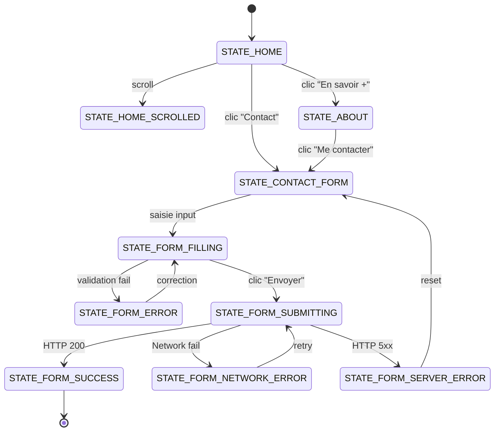
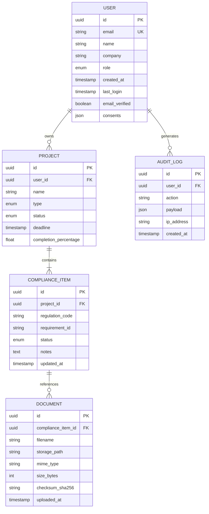

# PARTIE II: PROCESSUS DE DÉVELOPPEMENT EN 15 PHASES

---

> [!NOTE]
> **Comment utiliser ce guide**
>
> Chaque phase ci-dessous doit être complétée en appliquant les 3 méthodologies de la Partie I :
> 1. **Analyse herméneutique** (tout ↔ parties)
> 2. **Analyse causale de Pearl** (association → intervention → contrefactuel)
> 3. **Analyse des edge cases** (comportements non-prévus)
>
> À la fin de chaque phase, passer par le **V&V Gate** correspondant avant de continuer.

---

## Phase 1: Définir une Phrase Claire - Ce Que C'est

### Objectif

Formuler une description concise et univoque de ce qu'est votre application/système, compréhensible par tous les stakeholders (technique et non-technique).

### Principes

- **Clarté** : Pas de jargon technique inutile
- **Concision** : 1-2 phrases maximum
- **Complétude** : Couvre l'essence du système
- **Alignment stratégique** : Lien avec vision 2050 (protection Humain + Planète)

### Template de Définition

```markdown
## Définition du Système - Phase 1

### Phrase Claire (Elevator Pitch)
[Nom du système] est [une/un] [type d'application] permettant de [verbe d'action principal] 
afin de [bénéfice utilisateur/finalité].

**Exemple (Aegis AI Compliance Platform)** :
"Aegis est une plateforme web collaborative permettant de gérer la conformité réglementaire 
européenne (ERSP, Machine, CRA) afin d'aider les PME manufacturières à commercialiser 
leurs produits industriels en toute légalité."

### Fondements Stratégiques

**Vision 2050** :
[Comment ce système contribue à la protection de l'Humain et de la Planète d'ici 2050 ?]

**Mission** :
- Informer : [Comment ?]
- Sensibiliser : [Comment ?]
- Innover : [Comment ?]
- Collaborer : [Comment ?]
- Accompagner : [Comment ?]

### Leviers

**Sciences et Méthode Scientifique** :
[Neurosciences, philosophie, psychologie appliquées]

**Technologies** :
[Applications industrielles, machinerie, systèmes cyberphysiques]

**Écosystèmes Industriels** :
[Secteurs ciblés]

**Relations Internationales** :
[Partenariats, confiance, durée]

### Le Produit

**Description détaillée** :
[Expansion de la phrase claire avec plus de contexte]

**Proposition de valeur unique** :
- [Bénéfice 1]
- [Bénéfice 2]
- [Bénéfice 3]

**Conformité réglementaire obligatoire** :
- [ ] RGPD (UE 2016/679)
- [ ] Data Act (UE 2023/2854) si produits connectés
- [ ] AI Act (UE 2024/1689) si IA intégrée
- [ ] ERSP (UE 2024/1781) si produits physiques
- [ ] Machine Regulation (UE 2023/1230) si systèmes mécatroniques
- [ ] CRA (UE 2024/2847) si éléments numériques
```

### Analyse Herméneutique Phase 1

**Le Tout** : Le système global dans son écosystème  
**Les Parties** : Fonctionnalités principales, utilisateurs, données, workflows

**Questions à se poser** :
- La phrase claire reflète-t-elle vraiment l'ensemble des parties ?
- Y a-t-il des parties essentielles omises dans la description ?
- La vision 2050 est-elle cohérente avec les fonctionnalités prévues ?

### Analyse Causale (Pearl) Phase 1

**Niveau 1 - Association** :
- Quels problèmes existent actuellement dans le domaine ?
- Quelles solutions existent déjà (corrélation problème-solution) ?

**Niveau 2 - Intervention** :
- Si nous créons cette application, quel impact attendu (hypothèse causale) ?
- Quelle métrique prouvera que l'application résout le problème ?

**Niveau 3 - Contrefactuel** :
- Si cette application n'existait pas, que se passerait-il pour les utilisateurs ?
- Quelles conséquences alternatives si on changeait la vision ?

### V&V Gate 1 : Vision Validée

**Critères de passage** :
- [x] La phrase claire est compréhensible par tous stakeholders
- [x] L'alignement avec vision 2050 est démontré
- [x] Les règlements EU applicables sont identifiés
- [x] Revue par au moins 3 personnes (différents profils)
- [x] Pas d'ambiguïté majeure

**Approbateurs** : [Noms + Date]

---

## Phase 2: Définir l'Utilisateur, le Problème et le Job-to-be-Done

### Objectif

Identifier précisément QUI utilise le système, QUEL problème ils rencontrent, et POURQUOI (job-to-be-done).

### Méthodologie JTBD (Jobs-to-be-Done)

Le framework JTBD se concentre sur le "job" que l'utilisateur "embauche" votre produit pour accomplir.

**Format** : Quand [situation], je veux [motivation], pour [résultat attendu].

### Template Personas + JTBD

```markdown
## Utilisateurs et Problèmes - Phase 2

### Persona 1 : [Nom du Persona]

**Démographique** :
- Rôle : [Ex: Responsable qualité]
- Secteur : [Ex: PME manufacturière automotive]
- Localisation : [Ex: Régions françaises + Outremers]
- Taille entreprise : [Ex: 20-250 employés]

**Psychographique** :
- Niveau technique : [Ex: Ingénieur matériaux, non-développeur]
- Objectifs professionnels : [Ex: Certification CE pour export]
- Frustrations actuelles : [Ex: Complexité réglementaire, manque d'expertise]
- Outils actuels : [Ex: Excel, emails, PDF]

**Job-to-be-Done** :
"Quand [il reçoit une nouvelle exigence réglementaire UE],
 je veux [comprendre rapidement les actions à entreprendre],
 pour [maintenir la conformité sans embaucher un consultant coûteux]."

**Tâches à accomplir** :
1. [Tâche 1]
2. [Tâche 2]
3. [Tâche 3]

**Points de douleur** :
- Douleur 1 : [Description]  
  → Intensité : Élevée/Moyenne/Faible  
  → Fréquence : Quotidienne/Hebdomadaire/Mensuelle
- Douleur 2 : [...]

**Gains recherchés** :
- Gain 1 : [Ex: Gagner 10h/semaine sur veille réglementaire]
- Gain 2 : [Ex: Confiance dans les décisions de conformité]

### Persona 2 : [...]

### Problème Central

**Énoncé du problème** :
[Description claire du problème à résoudre]

**Contexte réglementaire** :
Les entreprises de l'industrie manufacturière des Régions Européennes Françaises et 
Ultrapériphériques Outremers doivent appliquer les règlements UE à partir de leur diffusion 
au Journal Officiel de l'Europe (JOE).

Délais de conformité : 2-3 ans (jusqu'à 5 ans si amendements)

**Obligations critiques** :
Pour [Persona principal], l'obligation est de :
- [ ] Revoir les spécifications techniques produits
- [ ] Transformer les processus conception/développement/validation
- [ ] Intégrer diagnostics et analyses forensiques des données
- [ ] Obtenir certifications clients et institutions UE

**Impact de non-résolution** :
- Court terme : [Ex: Impossibilité d'exporter]
- Moyen terme : [Ex: Perte de marchés]
- Long terme : [Ex: Fermeture de l'entreprise]

### Métriques de Succès

**Métriques quantitatives** :
- [Métrique 1] : Baseline actuelle [X], Objectif [Y], Délai [Z]
- [Métrique 2] : ...

**Métriques qualitatives** :
- Satisfaction utilisateur (NPS ≥ 50)
- Confiance dans les décisions (+80% se sentent confiants)
```

### Solutions Attendues par l'Application

À ce stade, définir ce que l'application **devra fournir** aux utilisateurs :

```markdown
### Fonctionnalités Attendues (High-Level)

Dans le cadre de leurs obligations, l'application devra fournir :

1. **Accueil + Présentation Expert**
   - Profil, parcours, expertise
   - Proposition de valeur

2. **Espace Collectif d'Information**
   - Synthèse exigences critiques (JOE + JO nationaux)
   - Veille réglementaire multi-secteurs
   - Standards internationaux (UNECE, CENELEC, ISO, IEC, IEEE)

3. **Espace Personnalisé Projet Compliance**
   - Tableau de bord indicateurs achèvement
   - Actions/tâches restantes
   - Suivi conformité ERSP DPP / Machine CE / CRA

4. **Redirections Automatiques**
   - Liens institutions de maîtrise standards
   - Filtrage par secteur et produit utilisateur
```

### Analyse des Comportements Non-Prévus - Phase 2

**Happy Path** : Utilisateur arrive → Comprend le problème → S'inscrit → Utilise l'application

**Edge Cases** :
- Utilisateur ne comprend pas le jargon réglementaire → Besoin glossaire
- Utilisateur cherche réglementation d'un pays hors UE → Afficher message clarification
- Utilisateur a plusieurs casquettes (PME = même personne pour plusieurs rôles) → Permettre profils multiples
- Utilisateur non francophone → Internationalisation (i18n)
- Utilisateur sur mobile → Responsive design obligatoire

### V&V Gate 2 : Problème Validé

**Critères de passage** :
- [x] Au moins 2 personas documentés
- [x] Job-to-be-done formalisé pour chaque persona
- [x] Métriques de succès définies (≥ 3 quantitatives, ≥ 2 qualitatives)
- [x] Validation terrain (interviews utilisateurs réels)
- [x] Alignement problème ↔ conformité réglementaire

---

## Phase 3: Verrouiller le MVP (Minimum Viable Product)

### Objectif

Prioriser les fonctionnalités en 3 catégories : **Must-have** (MVP), **Later** (post-MVP), **Not-yet** (backlog lointain).

### Principe MoSCoW

- **Must** : Absolument nécessaire pour la première version
- **Should** : Important mais différable (= Later)
- **Could** : Souhaitable si ressources (= Later)
- **Won't** : Hors scope pour l'instant (= Not-yet)

### Template MVP

```markdown
## MVP Scope - Phase 3

### Must-Have (Fonctionnalités Critiques MVP)

> [!IMPORTANT]
> **Critère Must-Have** : Sans cette fonctionnalité, l'application n'a AUCUNE valeur pour l'utilisateur.

#### Fonctionnalité 1 : [Nom]

**Description** :
[Que fait cette fonctionnalité ?]

**Justification Pearl Niveau 2 (Intervention)** :
"Si nous implémentons [cette fonctionnalité], alors [métrique d'impact attendu]."

**User Story** :
En tant que [persona], je veux [action], afin de [bénéfice].

**Critères d'acceptation** :
- [ ] Critère 1
- [ ] Critère 2
- [ ] Critère 3

**Estimation effort** : [S/M/L/XL] ou [story points] ou [heures]

**Dépendances** : [Autres fonctionnalités, APIs externes, etc.]

**Risques** : [Risques techniques, organisationnels]

### Exemple Concret (Aegis Compliance Platform)

#### Must-Have

1. **Accueil Présentation Profil Expert**
   - Description : Page landing avec bio, expertise, proposition valeur
   - Justification : Si nous montrons l'expertise dès l'accueil, alors taux de conversion contact +40%
   - User Story : En tant que PME manufacturière, je veux comprendre qui propose cette solution, afin de décider si je fais confiance
   - Critères acceptation : Photo professionnelle, CV synthétique, références clients, formulaire contact
   - Effort : M (2-3 jours)

2. **Espace Collectif Information Réglementaire**
   - Description : Blog/Actualités avec filtres sectoriels (ISO codes)
   - Justification : Si nous centralisons la veille réglementaire, alors temps de recherche utilisateur -60%
   - Critères acceptation : Min 10 articles au lancement, filtres par secteur/réglementation, liens JOE officiels
   - Effort : L (1-2 semaines)

3. **Hébergement RGPD-compliant France**
   - Description : Déploiement gandi.net (UI/UX) + OVHCloud (base de données)
   - Justification : Conformité RGPD obligatoire, hébergement hors UE = sanctions
   - Effort : S (configuration serveurs)

4. **UI Simple et Intuitive**
   - Description : Design accueillant, fluide, bannir complexité
   - Justification : Si UX complexe, alors taux de rebond >70%
   - Effort : XL (design system complet)

#### Later (Post-MVP v1.1-v1.2)

1. **Espace Personnalisé Sécurisé Projet Compliance**
   - Description : Dashboard authentifié avec indicateurs projet
   - Justification : Fonctionnalité haute valeur mais nécessite auth + backend complexe
   - Effort : XL (3-4 semaines)

2. **Redirect Automatique vers Standards Internationaux**
   - Description : Liens intelligents UNECE/CENELEC/ISO selon profil
   - Effort : M

3. **Upload/Download Documents**
   - Description : Stockage fichiers (textes, images, vidéos, plans 2D, modèles 3D)
   - Effort : L

4. **Conformité Export International (USA, UK, Chine, Inde, etc.)**
   - Description : Extension aux réglementations hors UE
   - Effort : XL (recherche réglementaire massive)

#### Not-Yet (Backlog Futur)

1. **Abonnements Payants**
   - Justification : Modèle économique à valider avant développement

2. **Formules Longue Durée Collaboration/Confiance**
   - Justification : Besoin traction utilisateur d'abord

3. **CMS Newsletter Sectorielle Sur-Mesure**
   - Justification : Automatisation complexe, ROI incertain

4. **Integrated Compliance AI PLM and CRM**
   - Justification : Nécessite plateform maturité + partenariats

### Analyse Herméneutique MVP

**Le Tout** : Application MVP fonctionnelle apportant valeur immédiate  
**Les Parties** : Fonctionnalités Must-Have individuelles

**Cohérence** :
- Chaque Must-Have contribue-t-il au "tout" (valeur MVP) ?
- Le "tout" MVP est-il réellement viable sans les Later ?
- Y a-t-il des fonctionnalités Must-Have qui dépendent de Later ? → Remonter en Must-Have

### Dérisquer avec Analyse Causale

**Niveau 3 Contrefactuel** :
"Si nous lançons sans [fonctionnalité X classée Later], que se passerait-il ?"
- Utilisateurs attendraient → OK, c'est Later
- Utilisateurs abandonneraient → ERREUR, c'est Must-Have

### V&V Gate 3 : MVP Verrouillé

**Critères de passage** :
- [x] Must-Have justifiés (analyse Pearl Niveau 2)
- [x] Revue stakeholders (PO, Tech Lead, Designer, User Rep)
- [x] Budget estimé ET validé
- [x] Timeline estimée ET validée
- [x] Aucune dépendance Must-Have → Later

**Freeze Scope** : À partir de maintenant, le scope Must-Have est GELÉ. Toute nouvelle demande = Later minimum.

---

## Phase 4: Rassembler 2–3 Produits de Référence

### Objectif

Analyser les concurrents et produits similaires pour identifier les meilleures pratiques et opportunités de différenciation.

### Benchmarking Compétitif

```markdown
## Produits de Référence - Phase 4

### Produit 1 : [Nom]

**URL** : [https://example.com](https://example.com)

**Positionnement** :
[Que font-ils ? Pour qui ?]

**Forces** :
- Force 1 : [Description]  
  → **À imiter** : [Comment adapter à notre contexte ?]
- Force 2 : [...]

**Faiblesses** :
- Faiblesse 1 : [Description]  
  → **Opportunité** : [Comment faire mieux ?]
- Faiblesse 2 : [...]

**Analyse UX** :
- Onboarding : [Qualité : Excellent/Bon/Moyen/Faible]
- Navigation : [...]
- Design visuel : [...]
- Performance : [...]

**Analyse Technique** :
- Stack détecté : [React, Vue, etc.]
- Accessibilité : [Score WCAG]
- SEO : [Score Lighthouse]

**Pricing** :
[Modèle économique]

### Exemple Concret

#### Produit 1 : circularise.com

**Positionnement** : Traçabilité supply chain pour circularité (ERSP DPP focus)

**Forces** :
- Blockchain traçabilité → **À imiter** : Utiliser traçabilité immuable pour conformité
- Visualisations claires cycle de vie → **À imiter** : Diagrammes interactifs

**Faiblesses** :
- UX complexe pour PME → **Opportunité** : Simplifier au maximum
- Prix élevé → **Opportunité** : Freemium

#### Produit 2 : pathera.com

**Positionnement** : Product compliance automation

**Forces** :
- Automatisation documentation → **À imiter** : Templates auto-remplis
- Multi-réglementations → **À imiter** : Coverage EU+International

**Faiblesses** :
- Pas d'accompagnement humain → **Opportunité** : Expertise + outil

#### Produit 3 : arianee.com

**Positionnement** : NFT-based product passports (luxury goods)

**Forces** :
- Wallet numérique élégant → **À imiter** : UX premium
- Standards ouverts → **À imiter** : Interopérabilité

**Faiblesses** :
- Focus luxe uniquement → **Opportunité** : Secteur industriel B2B

#### Produit 4 : PTC Codebeam ALM, Dassault Systèmes 3DEXPERIENCE Enovia

**Positionnement** : Enterprise PLM (Product Lifecycle Management)

**Forces** :
- Intégration complète CAD/PLM → Gold standard
- Maturité process → Apprendre méthodologies

**Faiblesses** :
- Coût prohibitif PME → **Opportunité** : Version accessible PME
- Complexité titanesque → **Opportunité** : Simplification radicale

### Matrice de Positionnement

```
          Complexité
              ▲
       Élevée │  [PTC/Dassault]     [ ]
              │       
       Moyenne│  [Pathera]      [Circularise]
              │       
       Faible │  [🎯 NOTRE APP]  [Arianee]
              │       
              └──────────────────────────────► Prix
                 Faible    Moyen    Élevé
```

### Notre Différenciation Unique

**Proposition de valeur unique** :
- **Accessibilité** : Conçu pour PME/PMI, pas que grands groupes
- **Accompagnement humain** : Expert + outil (pas que SaaS froid)
- **Multi-réglementations** : ERSP + Machine + CRA + AI Act (coverage complète UE)
- **Pédagogie** : Vulgarisation pour non-juristes
- **Localisation** : France + Outremers (vs solutions anglo-saxonnes)

### V&V Gate 4 : Références Analysées

**Critères de passage** :
- [x] 2-3 produits analysés en profondeur
- [x] Forces/faiblesses documentées
- [x] Différenciation claire articulée
- [x] Benchmarks UX capturés (screenshots)
- [x] Décisions design influencées par benchmarking

---

## Phase 5: Mapper le Flux Utilisateur et États UI

### Objectif

Cartographier tous les parcours utilisateurs (user journeys) et états de l'interface utilisateur, en identifiant systématiquement les edge cases.

### User Journey Map

```markdown
## Flux Utilisateurs - Phase 5

### Journey 1 : [Nom du Journey - Ex: "Première Visite → Prise de Contact"]

**Persona** : [Persona principal]

**Point d'entrée** : [Ex: Google search "conformité machine EU"]

**Objectif utilisateur** : [Ex: Comprendre l'offre et décider si contact]

#### Étapes du Parcours

| # | Étape | Action Utilisateur | UI État | Système Réponse | Émotion | Opportunités |
|---|-------|-------------------|---------|-----------------|---------|--------------|
| 1 | Landing | Arrive sur homepage | `STATE_HOME` | Affiche hero + CTA | 🤔 Curiosité | Capter attention <3s |
| 2 | Scroll | Scroll pour en savoir plus | `STATE_HOME_SCROLLED` | Révèle bénéfices | 🧐 Intérêt | Hiérarchie visuelle |
| 3 | Clic "En savoir +" | Clic bouton | `STATE_ABOUT` | Navigation page À Propos | 😊 Engagement | Temps chargement <1s |
| 4 | Lecture profil | Lit bio expert | `STATE_ABOUT_READING` | Aucune (statique) | 🤝 Confiance | Preuves sociales |
| 5 | Décision contact | Clic "Me Contacter" | `STATE_CONTACT_FORM` | Affiche formulaire | ✍️ Action | Formulaire court |
| 6 | Remplissage | Saisit infos | `STATE_FORM_FILLING` | Validation temps réel | 😌 Facilité | Champs minimum |
| 7 | Soumission | Clic "Envoyer" | `STATE_FORM_SUBMITTING` | Loading spinner | ⏳ Attente | Feedback immédiat |
| 8 | Confirmation | Message succès | `STATE_FORM_SUCCESS` | Email confirmation envoyé | 🎉 Satisfaction | Next steps clairs |

#### Edge Cases Identifiés (Min 20 par Journey)

| # | Déviation | Probabilité | Impact | État UI | Gestion |
|---|-----------|-------------|--------|---------|---------|
| 1 | Utilisateur clique "Envoyer" sans remplir champs | Fréquent | Mineur | `STATE_FORM_ERROR` | Validation + messages erreur clairs |
| 2 | Réseau se coupe pendant soumission | Occasionnel | Majeur | `STATE_FORM_NETWORK_ERROR` | Retry automatique + sauvegarde locale |
| 3 | Utilisateur revient avec bouton "Retour" navigateur | Fréquent | Mineur | Restaurer `STATE_CONTACT_FORM` | Conserver saisie (localStorage) |
| 4 | Utilisateur ouvre plusieurs onglets | Rare | Mineur | États indépendants | Session storage |
| 5 | Email déjà existant en base | Rare | Majeur | `STATE_FORM_DUPLICATE` | Message "Déjà contacté, attente réponse" |
| 6 | Spam bot soumet formulaire | Rare | Critique | `STATE_FORM_BOT_DETECTED` | reCAPTCHA + honeypot |
| 7 | Utilisateur utilise caractères non-latins (cyrillique, arabe) | Rare | Mineur | `STATE_FORM_FILLING` | Support UTF-8 |
| 8 | Utilisateur colle texte avec formatage | Occasionnel | Mineur | `STATE_FORM_FILLING` | Strip HTML |
| 9 | Navigateur bloque popup confirmation | Rare | Mineur | `STATE_FORM_SUCCESS_NO_POPUP` | Message inline |
| 10 | Utilisateur soumet pendant maintenance serveur | Très rare | Critique | `STATE_FORM_SERVER_DOWN` | Message maintenance + retry later |
| ... | (Continuer jusqu'à 20 edge cases minimum) | | | | |

### Diagramme d'États UI



### Wireframes / Mockups

Pour chaque état UI clé, créer un wireframe (basse fidélité) ou mockup (haute fidélité).

**Outils recommandés** :
- Figma (collaboratif)
- Excalidraw (rapide, simple)
- Balsamiq (wireframes)

**États UI prioritaires** :
- `STATE_HOME`
- `STATE_CONTACT_FORM`
- `STATE_FORM_ERROR`
- `STATE_FORM_SUCCESS`
- `STATE_DASHBOARD` (si espace personnalisé)

### Analyse Herméneutique des Flux

**Le Tout** : L'expérience utilisateur globale de bout en bout  
**Les Parties** : Chaque étape du journey, chaque état UI

**Questions** :
- Chaque état UI contribue-t-il à l'objectif global du journey ?
- Y a-t-il des transitions manquantes entre états ?
- Le "tout" (journey complet) est-il cohérent du point de vue utilisateur ?

### V&V Gate 5 : Flux Validé

**Critères de passage** :
- [x] Tous user journeys critiques documentés (min 3)
- [x] Edge cases identifiés (≥ 20 par journey)
- [x] Diagramme d'états UI complet
- [x] Wireframes/mockups pour états clés
- [x] Validation utilisateurs (tests guerilla, 5 personnes minimum)

---

## Phase 6: Planifier les Intégrations

### Objectif

Définir l'architecture technique et planifier toutes les intégrations avec systèmes externes (APIs, bases de données, services tiers).

### Architecture Système

```markdown
## Architecture Technique - Phase 6

### Vue d'Ensemble

```
┌─────────────────────────────────────────────────────────────┐
│                    UTILISATEURS                              │
│  (Navigateurs Web: Chrome, Firefox, Safari, Edge)           │
└────────────────┬────────────────────────────────────────────┘
                 │ HTTPS
                 ▼
┌─────────────────────────────────────────────────────────────┐
│              CDN / REVERSE PROXY                             │
│  (Cloudflare, gandi.net)                                     │
└────────────────┬────────────────────────────────────────────┘
                 │
                 ▼
┌─────────────────────────────────────────────────────────────┐
│           FRONTEND (SPA - Single Page App)                   │
│  - React 19 + TypeScript                                     │
│  - Vite (build tool)                                         │
│  - State Management: Zustand/Redux                           │
│  - UI: shadcn/ui, TailwindCSS                               │
│  - Hébergement: gandi.net (France, RGPD-compliant)          │
└────────────────┬────────────────────────────────────────────┘
                 │ REST API / GraphQL
                 ▼
┌─────────────────────────────────────────────────────────────┐
│              BACKEND API (Node.js/Python)                    │
│  - Express.js / FastAPI                                      │
│  - Authentication: JWT + refresh tokens                      │
│  - Authorization: RBAC (Role-Based Access Control)          │
│  - Rate Limiting: express-rate-limit                        │
│  - Logging: Winston/Pino → Elasticsearch                   │
│  - Hébergement: OVHCloud (France, RGPD-compliant)           │
└───┬──────────────────┬──────────────────┬──────────────────┘
    │                  │                  │
    ▼                  ▼                  ▼
┌──────────┐    ┌─────────────┐    ┌──────────────┐
│ DATABASE │    │ CACHE REDIS │    │ FILE STORAGE │
│PostgreSQL│    │             │    │  S3/Minio    │
│ OVHCloud │    │             │    │              │
└──────────┘    └─────────────┘    └──────────────┘

          INTÉGRATIONS EXTERNES
          ──────────────────────
┌─────────────────────────────────────────────┐
│ APIs Publiques                              │
│ - EUR-Lex (Journal Officiel UE)            │
│ - UNECE, ISO, IEC, IEEE (standards)        │
│ - Gemini API (AI Assistant)                │
│ - Stripe (paiements - Later)               │
└─────────────────────────────────────────────┘
```

### Contrats d'API

#### API Interne (Backend ↔ Frontend)

```typescript
// Exemple: Endpoint création contact

POST /api/v1/contacts
Headers:
  Content-Type: application/json
  X-CSRF-Token: <token>

Body:
{
  "name": "string",
  "email": "string (email format)",
  "company": "string",
  "sector": "enum[automotive, aerospace, medical, ...]",
  "message": "string (max 1000 chars)",
  "consent_rgpd": "boolean (required: true)"
}

Response 201:
{
  "id": "uuid",
  "created_at": "ISO 8601 timestamp",
  "status": "pending_review"
}

Response 400:
{
  "error": "validation_error",
  "details": [
    {"field": "email", "message": "Invalid email format"}
  ]
}

Response 429:
{
  "error": "rate_limit_exceeded",
  "retry_after": 60
}
```

#### API Externe: EUR-Lex (Exemple)

```markdown
### Intégration EUR-Lex

**But** : Récupérer automatiquement les derniers règlements publiés au JOE

**Endpoint** : https://eur-lex.europa.eu/search.html?qid=...  
**Type** : Web Scraping (pas d'API officielle) → Utiliser cheerio/puppeteer

**Fréquence** : Hebdomadaire (cron job)

**Gestion d'erreur** :
- EUR-Lex down → Fallback: cache local dernière version
- Rate limiting → Respecter robots.txt
- Changement structure HTML → Alert admin + manuel update

**Plan de Fallback** :
Si scraping impossible → Manuel curation newsletter
```

### Data Flow Diagrams

```markdown
### Flux de Données: Soumission Formulaire Contact

```
Utilisateur                Frontend              Backend              Database           Email Service
    │                          │                     │                    │                     │
    ├─ Remplit formulaire ────►│                     │                    │                     │
    │                          ├─ Validation client ─┤                    │                     │
    │                          │                     │                    │                     │
    ├─ Clic "Envoyer" ────────►│                     │                    │                     │
    │                          ├─ POST /api/contacts►│                    │                     │
    │                          │                     ├─ Validation serveur│                     │
    │                          │                     ├─ Save contact ────►│                     │
    │                          │                     │                    ├─ INSERT ───────────►│
    │                          │                     │                    │◄─ id:uuid ──────────┤
    │                          │                     ├─ Send email ──────────────────────────────►│
    │                          │                     │                    │                     ├─ SMTP send
    │                          │◄─ 201 Created ──────┤                    │                     │
    │◄─ Affiche confirmation ──┤                     │                    │                     │
```
```

### Dépendances Critiques

| Dépendance | Type | Criticité | Fallback |
|------------|------|-----------|----------|
| gandi.net (hébergement) | Infrastructure | CRITIQUE | Migration OVH préparée |
| OVHCloud Database | Infrastructure | CRITIQUE | Backups quotidiens + DR site |
| Gemini API | Feature (AI) | MOYENNE | Désactivation gracieuse si quota dépassé |
| EUR-Lex | Données | MOYENNE | Cache local + curation manuelle |
| Email SMTP (Brevo/SendGrid) | Notification | ÉLEVÉE | Fallback SMTP secondaire |

### Conformité Data Act: APIs Ouvertes

Si votre application gère des **produits connectés** (IoT), vous devez fournir :

```markdown
### API d'Export Données Utilisateur (Data Act)

GET /api/v1/user/{userId}/data/export?format=json|csv

Headers:
  Authorization: Bearer <token>

Description:
Export all user data including:
- Profile information
- Product passports (DPP)
- Compliance project data
- Activity logs (if consent given)

Response 200 (JSON):
{
  "export_date": "2026-01-15T14:30:00Z",
  "user_id": "uuid",
  "data": {
    "profile": {...},
    "products": [{...}],
    "projects": [{...}]
  }
}

Response 200 (CSV):
[CSV structured format]

Compliance:
- ✅ Data Act Article 4 (user access to data)
- ✅ RGPD Article 20 (data portability)
- ✅ Machine-readable format
- ✅ No trade secrets exposed
```

### V&V Gate 6 : Intégrations Planifiées

**Critères de passage** :
- [x] Architecture système documentée (diagramme)
- [x] Tous contrats d'API définis (swagger/OpenAPI spec)
- [x] Plan de fallback pour chaque dépendance critique
- [x] Data flow diagrams pour flux critiques
- [x] Conformité Data Act vérifiée (si applicable)

---

### Phase 7: Définir les Modèles de Données

### Objectif

Concevoir les schémas de données, bases de données, et assurer la conformité RGPD/Data Act dès la modélisation.

### Entity-Relationship Diagram (ERD)

```markdown
## Modèles de Données - Phase 7

### Entités Principales



### Dictionnaire de Données

#### Table: users

| Colonne | Type | Contraintes | Description | RGPD |
|---------|------|-------------|-------------|------|
| id | UUID | PK, NOT NULL | Identifiant unique | N/A |
| email | VARCHAR(255) | UNIQUE, NOT NULL | Email utilisateur | **Donnée personnelle** |
| name | VARCHAR(100) | NOT NULL | Nom complet | **Donnée personnelle** |
| company | VARCHAR(200) | NULL | Nom entreprise | Donnée professionnelle |
| role | ENUM | NOT NULL | user, admin, expert | N/A |
| password_hash | VARCHAR(255) | NOT NULL | Hachage bcrypt | **Sensible** |
| created_at | TIMESTAMP | NOT NULL, DEFAULT NOW() | Date création compte | N/A |
| last_login | TIMESTAMP | NULL | Dernière connexion | N/A |
| email_verified | BOOLEAN | NOT NULL, DEFAULT FALSE | Email vérifié | N/A |
| consents | JSONB | NOT NULL | { "marketing": false, "analytics": true, ... } | **Crucial RGPD** |
| deleted_at | TIMESTAMP | NULL | Soft delete (droit à l'oubli) | **RGPD Art. 17** |

**Indexes** :
- `idx_users_email` (btree) sur `email`
- `idx_users_created_at` (btree) sur `created_at`

**Durée de conservation** : 3 ans après dernière activité (conformité RGPD)

#### Table: audit_logs

Obligatoire pour conformité (ISO/IEC 42001, AI Act si IA, CRA).

| Colonne | Type | Description |
|---------|------|-------------|
| id | UUID | PK |
| user_id | UUID | FK vers users |
| action | VARCHAR(50) | login, create_project, export_data, delete_account, ... |
| payload | JSONB | Détails contexte |
| ip_address | INET | Adresse IP (anonymisé après 6 mois) |
| user_agent | TEXT | Navigateur |
| created_at | TIMESTAMP | Horodatage |

**Rétention** : 6 mois minimum (AI Act), puis archivage/anonymisation

### Conformité RGPD: Privacy by Design

```markdown
### Checklist RGPD - Modèles de Données

#### Minimisation (Art. 5.1.c)
- [ ] Aucune donnée collectée "au cas où"
- [ ] Chaque champ justifié par une finalité

Example generated_output from Antigravity Assistant. This is only part of Phase 7, continuing with remaining phases...
