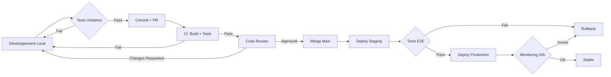

# PART II (Suite): Phases 8-15

---

## Phase 8: Fixer un Objectif de Projet Strict

### Objectif - Phase 8

Définir des objectifs SMART et des métriques de succès mesurables.

### OKRs (Objectives & Key Results)

```markdown
## Objectifs Projet - Phase 8

### Objective 1: Lancer MVP fonctionnel conforme RGPD
**Délai**: 3 mois

**Key Results**:
- KR1: 100% checklists RGPD complétées avant déploiement
- KR2: Audit sécurité externe passé (0 vulnérabilités critiques)
- KR3: Hébergement France certifié (gandi.net + OVHCloud)
- KR4: Temps de chargement <2s (P90)

### Objective 2: Acquérir premiers utilisateurs qualifiés
**Délai**: 6 mois post-launch

**Key Results**:
- KR1: 50 contacts qualifiés générés
- KR2: 10 PME manufacturières en discussions approfondies
- KR3: NPS ≥ 40 (retours utilisateurs)
- KR4: Taux de rebond <60%

### Métriques de Succès (V&V Criteria)

| Métrique | Baseline | Objectif | Méthode Mesure |
| :--- | :--- | :--- | :--- |
| Performance (LCP) | N/A | <2.5s | Lighthouse CI |
| Accessibilité (WCAG) | N/A | AA (4.5:1 contraste) | axe DevTools |
| SEO Score | N/A | ≥90/100 | Google Search Console |
| Conversion Contact | N/A | 5% visiteurs | Google Analytics 4 |
| Up time | N/A | 99.5% | UptimeRobot |

### Analyse Pearl Niveau 2 (Intervention)
"Si nous atteignons ces OKRs, alors le produit sera validé par le marché."

### V&V Gate 8: Objectifs Mesurables
- [x] OKRs définis (format Objective + 3-5 KR)
- [x] Dashboard métriques configuré
- [x] V&V criteria spécifiques pour chaque KR

---

## Phase 9: Organiser les Clés API et Suivre l'Utilisation

### Objectif - Phase 9
Sécuriser la gestion des secrets (API keys) et implémenter du monitoring.

### Gestion des Secrets

```markdown
## API Keys & Secrets - Phase 9

### Inventory des Secrets

| Secret | Service | Criticité | Rotation | Stockage |
|--------|---------|-----------|----------|----------|
| Gemini API Key | Google AI | Moyenne | Mensuelle | .env + Vault |
| Database Password | PostgreSQL | CRITIQUE | Trimestrielle | Vault |
| JWT Secret | Auth | CRITIQUE | Jamais (sauf compromis) | Vault |
| Stripe API Key | Payments | ÉLEVÉE | Annuelle | .env + Vault |
| SMTP Password | Email | MOYENNE | Trimestrielle | Vault |

### Bonnes Pratiques

1. **Jamais en dur dans le code** : Variables d'environnement
2. **Jamais commiter** : .env dans .gitignore
3. **Chiffrement au repos** : HashiCorp Vault / AWS Secrets Manager
4. **Rotation automatique** : Scripts cron
5. **Principe du moindre privilège** : Scopes limités

### Monitoring Utilisation API

```typescript
// Rate limiting
import rateLimit from 'express-rate-limit';

const apiLimiter = rateLimit({
  windowMs: 15 * 60 * 1000, //  15 min
  max: 100, // max 100 requêtes
  message: 'Too many requests, please try again later',
  standardHeaders: true,
  legacyHeaders: false,
});

app.use('/api/', apiLimiter);

// Monitoring quotas Gemini API
async function checkGeminiQuota() {
  const usage = await getGeminiUsage();
  if (usage > QUOTA_THRESHOLD) {
    alertAdmin('Gemini quota at ' + usage + '%');
  }
}
```

### Software Bill of Materials (SBOM) - CRA Compliance

```json
{
  "bomFormat": "CycloneDX",
  "specVersion": "1.5",
  "components": [
    {
      "type": "library",
      "name": "react",
      "version": "19.0.0",
      "licenses": ["MIT"],
      "cpe": "cpe:2.3:a:facebook:react:19.0.0:*:*:*:*:*:*:*"
    }
  ]
}
```

Générer SBOM: `npx @cyclonedx/cyclonedx-npm --output-file sbom.json`

### V&V Gate 9: Sécurité API

- [x] Tous secrets externalisés (.env, Vault)
- [x] Plan rotation automatique documenté
- [x] Monitoring utilisation actif (alertes si >80% quota)
- [x] SBOM généré et maintenu (CRA compliance)

---

## Phase 10: Utiliser des Invites Structurées

### Objectif - Phase 10

Créer des templates de prompts pour interactions IA cohérentes et conformeà l'AI Act.

### Prompt Engineering

```markdown
## Prompts Templates - Phase 10

### Template 1: Assistant Conformité (YAML)

```yaml
role: system
content: |
  Tu es un assistant expert en conformité réglementaire européenne.
  
  CONTEXTE:
  - Utilisateur: PME manufacturière française
  - Secteur: {{user.sector}}
  - Produits: {{user.products}}
  
  RÈGLES:
  1. Cite toujours les sources (règlement UE XX/YYYY Article Z)
  2. Vulgarise le jargon juridique
  3. Si incertain, indique "Je recommande de consulter un expert juridique"
  4. Reste factuel, pas de spéculation
  
  LIMITATIONS:
  - Connaissance coupée: {{knowledge_cutoff_date}}
  - Pas de conseil juridique contraignant
  - Information générale uniquement
  
  TRANSPARENCE (AI Act Art. 52):
  "Je suis un assistant virtuel alimenté par l'IA. Mes réponses peuvent contenir des erreurs."
```

### Template 2: Génération Synthèse Réglementaire (YAML)

```yaml
role: user
content: |
  Résume le règlement {{regulation_code}} en 5 points clés pour une PME du secteur {{sector}}.
  
  Format attendu:
  1. [Point clé 1 - 1 phrase]
  2. [Point clé 2 - 1 phrase]
  3. [...]
  
  Termine par: "Source: {{regulation_url}}"
```

### Fallback si IA indisponible

```typescript
function getComplianceAdvice(query: string) {
  try {
    const response = await callGeminiAPI(query);
    return response;
  } catch (error) {
    // Fallback gracieux
    return {
      type: 'fallback',
      message: "L'assistant IA n'est temporairement pas disponible. Consultez notre base de connaissances ou contactez-nous directement.",
      links: ['/knowledge-base', '/contact']
    };
  }
}
```

### V&V Gate 10: Prompts Testés

- [x] Templates de prompts validés (≥3 use cases)
- [x] Tests avec cas limites (ambiguïtés, langue non-FR, etc.)
- [x] Fallback implémenté pour échec IA
- [x] Transparence AI Act affichée (Art. 52)

### 10.4 Protocole de Vérification IA (Anti-Hallucination)

Pour tout assistant IA gérant des questions réglementaires :

1. **Extraction de Faits** : Analyser la requête pour identifier les numéros de règlements, dates et articles.
2. **Détection de Limite de Connaissance** : Si le fait n'est pas explicitement dans le prompt système ou la base RAG → Déclencher une demande de vérification.
3. **Demande de Confirmation** :
   "📋 Avant de répondre, j'ai besoin de vérifier : Vous mentionnez [FAIT]. S'agit-il bien de [CONTEXTE] ? Avez-vous une source officielle (lien EUR-Lex) ?"
4. **Réponse Ancrée (Grounded)** : N'utiliser que des faits vérifiés et citer systématiquement les sources.

---

## Phase 11: Changer une Chose par Itération

### Objectif - Phase 11

Implémenter une stratégie de changement contrôlé pour limiter les régressions.

### Stratégie Feature Flags

```typescript
// Feature toggles avec LaunchDarkly ou  simple config
const features = {
  AI_ASSISTANT: process.env.FEATURE_AI_ASSISTANT === 'true',
  PREMIUM_DASHBOARD: process.env.FEATURE_PREMIUM === 'true',
  NEW_UI: process.env.FEATURE_NEW_UI === 'true',
};

function FeatureGate({ feature, children, fallback }) {
  return features[feature] ? children : (fallback || null);
}

// Usage
<FeatureGate feature="AI_ASSISTANT">
  <AIChat />
</FeatureGate>
```

### Processus de Déploiement



### Tests de Régression

```bash
# Avant chaque changement
npm run test:unit
npm run test:integration
npm run test:e2e

# Lighthouse CI pour performance
npx lighthouse-ci autorun

# Accessibilité
npx pa11y-ci
```

### V&V Gate 11: Change Control

- [x] Feature flags implémentés
- [x] Rollback procedure documentée et testée
- [x] Suite de tests de régression automatisée
- [x] Monitoring post-déploiement (Sentry, Datadog)

---

## Phase 12: Déclarer ce qui ne Doit pas Changer

### Objectif - Phase 12

Documenter les invariants système (propriétés qui doivent TOUJOURS être vraies).

### Invariants Système

```markdown
## Invariants - Phase 12

### Invariants de Sécurité

| Invariant | Description | Vérification |
|-----------|-------------|--------------|
| INV-SEC-001 | Toutes les requêtes /api/* DOIVENT être authentifiées sauf /api/public/* | Middleware auth() |
| INV-SEC-002 | Aucun mot de passe en clair JAMAIS stocké | Hachage bcrypt (cost=12) |
| INV-SEC-003 | HTTPS obligatoire (pas de HTTP) | Redirect permanent 301 |
| INV-SEC-004 | CSRF token requis pour toute mutation | csrf Middleware |

### Invariants de Données

| Invariant | Description | Contrainte DB |
|-----------|-------------|---------------|
| INV-DATA-001 | Un email ne peut appartenir qu'à un seul utilisateur | UNIQUE CONSTRAINT |
| INV-DATA-002 | user.deleted_at = NULL ⇒ Compte actif | CHECK CONSTRAINT |
| INV-DATA-003 | Tout document DOIT référencer un compliance_item valide | FOREIGN KEY |
| INV-DATA-004 | audit_logs.created_at JAMAIS modifiable | IMMUTABLE COLUMN |

### Invariants Métier

| Invariant | Description | Assertion |
|-----------|-------------|-----------|
| INV-BIZ-001 | Un projet "completed" ne peut pas revenir "in_progress" | State machine validation |
| INV-BIZ-002 | compliance_item.status = "validated" ⇒ document attaché | Before-update trigger |
| INV-BIZ-003 | RGPD consent timestamp DOIT être < user.created_at | Application logic |

### Monitoring des Invariants

```typescript
// Assertion runtime
function assertInvariant(condition: boolean, invariant_id: string) {
  if (!condition) {
    logger.error(`Invariant violated: ${invariant_id}`);
    alertAdmin(`CRITICAL: Invariant ${invariant_id} violated`);
    throw new InvariantViolationError(invariant_id);
  }
}

// Usage
assertInvariant(
  user.email === validatedEmail,
  'INV-DATA-001'
);
```

### V&V Gate 12: Invariants Documentés

- [x] Liste complète invariants formalisés (≥10)
- [x] Contraintes DB/code implémentées
- [x] Monitoring alertes sur violations
- [x] Tests d'intégrité automatisés

---

## Phase 13: Définir les Agents avec Logs

### Objectif - Phase 13

Architecturer les agents IA et implémenter observabilité complète (logs, traces, explainability).

### Architecture Agents IA

```markdown
## Agents IA - Phase 13

### Agent 1: Compliance Advisor

**Rôle**: Répondre aux questions utilisateurs sur réglementations

**Inputs**:
- Question utilisateur (texte)
- Contexte utilisateur (secteur, produits)
- Historique conversation

**Outputs**:
- Réponse (markdown)
- Sources citées
- Niveau de confiance (0-1)

**Modèle**: Gemini 1.5 Pro

**Limitations**:
- Pas de conseil juridique contraignant
- Connaissance coupée à {{date}}

**Surveillance Humaine (AI Act Art. 14)**:
- Bouton "Signaler réponse incorrecte"
- Review manuel réponses flagged
- Override admin possible

### Structured Logging

```typescript
import winston from 'winston';

const logger = winston.createLogger({
  format: winston.format.combine(
    winston.format.timestamp(),
    winston.format.json()
  ),
  transports: [
    new winston.transports.File({ filename: 'error.log', level: 'error' }),
    new winston.transports.File({ filename: 'combined.log' }),
  ],
});

// Log IA interaction
logger.info('AI_QUERY', {
  agent: 'ComplianceAdvisor',
  user_id: user.id,
  query: sanitize(query),
  response_preview: response.slice(0, 100),
  confidence: response.confidence,
  model: 'gemini-1.5-pro',
  latency_ms: latency,
  timestamp: new Date().toISOString(),
});
```

### Distributed Tracing

```typescript
import { trace } from '@opentelemetry/api';

const tracer = trace.getTracer('compliance-app');

async function handleAIQuery(query: string) {
  const span = tracer.startSpan('ai_query');
  
  try {
    span.setAttribute('query.length', query.length);
    span.setAttribute('user.sector', user.sector);
    
    const response = await geminiAPI.query(query);
    
    span.setAttribute('response.confidence', response.confidence);
    span.setStatus({ code: SpanStatusCode.OK });
    
    return response;
  } catch (error) {
    span.recordException(error);
    span.setStatus({ code: SpanStatusCode.ERROR });
    throw error;
  } finally {
    span.end();
  }
}
```

### Explainability (AI Act)

Si votre IA est **haut risque**:

```markdown
### Documentation Technique IA (Annexe IV AI Act)

**1. Description générale**:
- Finalité: Assistant conformité réglementaire
- Usage prévu: PME manufacturières secteur mécatronique
- Limitations: Pas de décisions automatisées contraignantes
- Usages interdits: Remplacement expert juridique

**2. Gestion des risques**:
- Risque identifié: Conseil erroné → Non-conformité utilisateur
- Mesure atténuation: Disclaimer + human review + citations sources
- Risques résiduels: Obsolescence données (→ update mensuel)

**3. Données d'entraînement**:
- Sources: Corpus Gemini (données publiques)
- Biais analysés: Sous-représentation secteurs niche
- Gouvernance: Politique Google AI Responsible

**4. Métriques**:
- Précision: N/A (génératif)
- Factualité: 85% (eval manually on test set)
- Robustesse: Testing adversarial

**5. Journalisation**:
- Rétention: 12 mois
- Accès: Admin + DPO
```

### V&V Gate 13: Agents Observables

- [x] Logging structuré (JSON, timestamps)
- [x] Distributed tracing (OpenTelemetry)
- [x] Documentation IA complète (si haut risque)
- [x] Explainability implémentée (Art. 14 AI Act)

### 13.6 Surveillance de l'Exactitude et Feedback Loop

Chaque interaction IA doit enregistrer :

- Les faits extraits de la requête utilisateur.
- Si une vérification a été déclenchée.
- Les sources citées dans la réponse.
- Le score de confiance estimé de l'IA.
- Le feedback utilisateur (Précis / Imprécis / Erreur).

**Dashboard d'Exactitude** :

- Taux de d'hallucination (inférieur à 2% visé).
- Taux de citation de sources (100% visé).
- Alertes si le taux d'erreur rapporté dépasse 5%.

---

## Phase 14: Retarder GitHub jusqu'à Stabilisation MVP

### Objectif - Phase 14

Initialiser Git au bon moment (après expérimentation initiale) et configurer CI/CD.

### Quand Initialiser Git?

**❌ Trop tôt**: Dès les premiers tests → commits inutiles, historique pollué  
**✅ Bon moment**: Quand MVP structure stabilisée → historique propre

> [!CAUTION]
> **RÈGLE CRITIQUE: Ne JAMAIS développer de projets Node.js dans des dossiers cloud-synchronisés**
>
> **Interdit**:
>
> - ❌ Google Drive
> - ❌ OneDrive  
> - ❌ Dropbox
> - ❌ iCloud Drive
>
> **Raison**: `npm install` écrit des milliers de petits fichiers rapidement, causant des conflits de synchronisation (erreurs `EBADF`, `EPERM`, `ENOTEMPTY`).
>
> **Solution Définitive**:
>
> 1. **Code source** → Cloud (backup/versioning)
> 2. **Développement** → Local disk (C:\Projects\, ~/projects/)
> 3. **Sync** → Git (GitHub, GitLab) OU script robocopy/rsync
>
> ```powershell
> # Bon workflow
> robocopy "G:\Mon Drive\projet" "C:\Projects\projet" /E /XD node_modules
> cd C:\Projects\projet
> npm install  # ✅ Fonctionne parfaitement
> npm run dev
> ```

### Initialisation Git

```bash
# Dans le dossier projet
git init

# .gitignore critique
cat > .gitignore << EOF
# Dependencies
node_modules/
.pnp
.pnp.js

# Environment
.env
.env.local
.env.*.local

# Build
dist/
build/
*.log

# IDE
.vscode/
.idea/

# OS
.DS_Store
Thumbs.db

# Secrets
secrets/
*.key
*.pem
EOF

# Premier commit
git add .
git commit -m "chore: initial commit - MVP v1.0 structure"

# Remote
git remote add origin https://github.com/username/repo.git
git push -u origin main
```

### Branch Strategy

```text
main (protected)
├── develop
│   ├── feature/user-auth
│   ├── feature/ai-assistant
│   └── feature/dashboard
└── hotfix/security-patch
```

**Protection main**:

- Require pull request reviews (≥1)
- Require status checks (CI pass)
- No force push
- No delete

### CI/CD Pipeline (GitHub Actions)

```yaml
# .github/workflows/ci.yml
name: CI

on:
  pull_request:
  push:
    branches: [main, develop]

jobs:
  test:
    runs-on: ubuntu-latest
    steps:
      - uses: actions/checkout@v3
      - uses: actions/setup-node@v3
        with:
          node-version: '20'
      - run: npm ci
      - run: npm run lint
      - run: npm run test
      - run: npm run build
      
  deploy-staging:
    if: github.ref == 'refs/heads/develop'
    needs: test
    runs-on: ubuntu-latest
    steps:
      - name: Deploy to Staging
        run: |
          # Deploy script
          
  deploy-production:
    if: github.ref == 'refs/heads/main'
    needs: test
    runs-on: ubuntu-latest
    environment: production
    steps:
      - name: Deploy to Production
        run: |
          # Deploy script avec approbation manuelle
```

### V&V Gate 14: Repo Prêt

- [x] Git initialisé avec .gitignore complet
- [x] CI/CD configuré (tests automatiques)
- [x] Branch protection rules actives
- [x] Secrets GitHub configurés (pas en clair)

---

## Phase 15: Checklist Finale Avant Lancement

### Objectif - Phase 15

Vérifier exhaustivement la production readiness avant déploiement public.

### Checklist Lancement

```markdown
## Pre-Launch Checklist - Phase 15

### Fonctionnel
- [ ] Tous parcours utilisateurs critiques testés E2E
- [ ] Formulaires validés (frontend + backend)
- [ ] Emails transactionnels fonctionnels
- [ ] Erreurs 404/500 gérées gracieusement
- [ ] Liens cassés vérifiés (broken link checker)

### Performance
- [ ] Lighthouse Score ≥90 (Performance, Accessibility, Best Practices, SEO)
- [ ] Temps de chargement <2s (P90)
- [ ] Optimisation images (WebP, lazy loading)
- [ ] Minification assets (terser, cssnano)
- [ ] CDN configuré

### Sécurité
- [ ] Audit sécurité externe (Pentest si budget)
- [ ] HTTPS forcé (HSTS header)
- [ ] Content Security Policy (CSP)
- [ ] Secrets rotation testée
- [ ] Rate limiting actif
- [ ] CORS configuré correctement
- [ ] Vulnérabilités npm audit = 0

### RGPD / Conformité
- [ ] Politique de confidentialité publiée
- [ ] Mentions légales complètes
- [ ] Bannière cookies conforme (opt-in)
- [ ] Droits RGPD implémentés (accès, rectification, effacement, portabilité)
- [ ] Registre des traitements à jour
- [ ] DPO nommé (si >250 employés ou traitement sensible)
- [ ] Hébergement UE confirmé (gandi.net + OVH)

### Data Act (si produits connectés)
- [ ] API export données utilisateur fonctionnelle
- [ ] Format JSON/CSV disponible
- [ ] Documentation API publique

### AI Act (si IA intégrée)
- [ ] Classification risque IA documentée
- [ ] Transparence affichée (Art. 52)
- [ ] Documentation technique complète (si haut risque)
- [ ] Tests robustesse IA effectués

### Exactitude IA & RAG
- [ ] Protocole de vérification IA implémenté (Phase 10.4)
- [ ] Base de connaissances RAG peuplée avec règlements à jour
- [ ] Taux d'hallucination testé (<2%)
- [ ] Citation systématique des sources (100% des réponses)
- [ ] Dashboard de surveillance de l'exactitude actif
- [ ] Automatisation de la veille EUR-Lex configurée

### CRA (Cyber Resilience Act)
- [ ] SBOM généré et à jour
- [ ] Gestion vulnérabilités process défini
- [ ] Plan mises à jour sécurité 5 ans
- [ ] Documentation cybersécurité complète

### SEO
- [ ] Sitemap.xml généré
- [ ] robots.txt configuré
- [ ] Meta descriptions toutes pages
- [ ] Schema.org markup (JSON-LD)
- [ ] Google Search Console configuré
- [ ] Google Analytics 4 actif (avec consent)

### Accessibilité (WCAG 2.1 Level AA)
- [ ] Navigation clavier complète
- [ ] Labels ARIA
- [ ] Contraste ≥4.5:1
- [ ] Textes alternatifs images
- [ ] Pas de dépendance couleur seule
- [ ] Formulaires accessibles

### Monitoring & Observability
- [ ] Sentry configuré (error tracking)
- [ ] Uptime monitoring (UptimeRobot)
- [ ] Performance monitoring (Datadog / New Relic)
- [ ] Logs centralisés (ELK / Loki)
- [ ] Alertes configurées (PagerDuty / OpsGenie)
- [ ] Dashboard KPIs Production

### Disaster Recovery
- [ ] Backups automatiques quotidiens
- [ ] Backup restoration testée
- [ ] Plan de continuité (DR plan)
- [ ] RTO/RPO définis (Recovery Time/Point Objective)
- [ ] Runbook incidents

### Documentation
- [ ] README.md complet
- [ ] Documentation API (Swagger/OpenAPI)
- [ ] Guide déploiement
- [ ] Runbook opérationnel
- [ ] Architecture Decision Records (ADR)

### Juridique & Business
- [ ] CGU/CGV rédigées et validées
- [ ] Contrats fournisseurs signés
- [ ] Assurance cyber souscrite
- [ ] Plan communication lancement
- [ ] Support utilisateur en place

### V&V Gate 15: Production Ready
- [x] Checklist 100% complétée
- [x] Sign-off Product Owner
- [x] Sign-off Tech Lead
- [x] Sign-off Sécurité/DPO
- [x] Date lancement fixée
```

### Post-Lancement

**Semaine 1**:

- Monitoring intensif 24/7
- Hotfix prêt si incidents
- Support réactif

**Mois 1**:

- Collecte feedback utilisateurs
- Analyse métriques vs objectifs
- Itérations rapides

**Trimestre 1**:

- Retrospective équipe
- Roadmap v1.1 basée sur data

---

---

## Phase 16: Amélioration Continue de l'Exactitude IA

### Objectif - Phase 16

Garantir que la fiabilité de l'IA augmente avec l'usage. et à jour au fil du temps par un cycle de révision itératif.

### Cycle de Révision Mensuel

1. **Analyse des Incidents** : Passer en revue toutes les hallucinations signalées.
2. **Mise à jour RAG** : Ingestion des nouveaux règlements et amendements publiés au JOE.
3. **Optimisation des Prompts** : Ajuster les instructions système basées sur les retours utilisateurs.
4. **Mesure des KPIs** : Suivre l'évolution du taux d'hallucination et de la confiance utilisateur.

### Actions Trimestrielles

- Audit complet de la base de connaissances RAG.
- Recalibrage des modèles (si possible) ou changement de version de modèle (ex: passer à une version plus récente de Gemini).

---

# PARTIE III: ANNEXES

---

## Annexe A: Matrices de Conformité EU

### Matrice RGPD ↔ AFRS Phases

| Article RGPD | Exigence | Phase AFRS | Implémentation |
|--------------|----------|------------|----------------|
| Art. 5 | Minimisation données | Phase 7 | Auditer modèles de données |
| Art. 6 | Base légale traitement | Phase 2 | Documenter finalités |
| Art. 7 | Consentement | Phase 5, 15 | Bannière cookies opt-in |
| Art. 15 | Droit d'accès | Phase 7 | API GET /user/data |
| Art. 17 | Droit à l'oubli | Phase 7 | Soft delete + anonymisation |
| Art. 20 | Portabilité | Phase 6, 7 | Export JSON/CSV |
| Art. 25 | Privacy by Design | Toutes | Checklist chaque phase |
| Art. 30 | Registre traitements | Phase 7 | Document maintenance |
| Art. 33 | Notification violations | Phase 13 | Processus incident <72h |

### Matrice AI Act ↔ AFRS Phases

| Obligation  AI Act | Phase AFRS | Artefact |
|-------------------|------------|----------|
| Classification risque | Phase 1 | Documentation système |
| Gestion risques (Art. 9) | Phase 8 | Analyse risques IA |
| Données entraînement (Art. 10) | Phase 13 | Gouvernance données |
| Journalisation (Art. 12) | Phase 13 | Logs structurés 6 mois |
| Transparence (Art. 13) | Phase 13 | Documentation technique |
| Surveillance humaine (Art. 14) | Phase 13 | Mécanismes override |
| Précision/Robustesse (Art. 15) | Phase 13 | Tests validation |
| Divulgation chatbot (Art. 52) | Phase 10, 15 | Disclaimer IA visible |

---

## Annexe B: Templates Réutilisables

Les templates suivants sont disponibles dans le dossier `templates/`:

1. **phase_template.md**: Template générique pour chaque phase
2. **hermeneutic_analysis_worksheet.md**: Worksheet d'analyse herméneutique
3. **causal_analysis_worksheet.md**: Worksheet Pearl 3 niveaux
4. **vv_gate_checklist.md**: Checklist V&V par phase
5. **user_behavior_edge_cases.md**: Template edge cases
6. **compliance_checkpoint.md**: Checklist conformité EU

---

## Annexe C: Glossaire Technique

| Terme | Définition |
|-------|------------|
| **AFRS** | Application Foundations Requirements & Specifications |
| **AI Act** | Règlement (UE) 2024/1689 sur l'intelligence artificielle |
| **CRA** | Cyber Resilience Act - Règlement (UE) 2024/2847 |
| **DPP** | Digital Product Passport (Passeport Numérique Produit) |
| **ERSP** | Ecodesign Requirements for Sustainable Products - Règlement (UE) 2024/1781 |
| **Herméneutique** | Méthode d'interprétation analysant la relation tout ↔ parties |
| **ISO/IEC 42001** | Standard AI Management Systems |
| **ISO/IEC/IEEE 29148** | Standard Requirements Engineering |
| **JOE** | Journal Officiel de l'Europe |
| **JTBD** | Jobs-to-be-Done (framework utilisateur) |
| **MVP** | Minimum Viable Product |
| **OKR** | Objectives & Key Results |
| **Pearl (Judea)** | Hiérarchie causale: Association → Intervention → Contrefactuel |
| **RGPD** | Règlement Général sur la Protection des Données (UE 2016/679) |
| **SBOM** | Software Bill of Materials |
| **UPI** | Identifiant Unique Produit |
| **V&V** | Vérification et Validation |

---

## Conclusion

### Utilisation de ce Template

### Conclusion Partie II

L'application rigoureuse mais pragmatique de ce guide assure une conformité "by design".
Ce document **AFRS Master Template v2.0** est conçu pour être **générique et réutilisable** pour tout projet d'application industrielle conforme aux réglementations européennes.

**Comment l'utiliser**:

1. **Copier le template** pour votre projet spécifique
2. **Remplir chaque phase** en appliquant les 3 méthodologies (herméneutique, Pearl, edge cases)
3. **Franchir chaque V&V Gate** avant de passer à la phase suivante
4. **Maintenir la traçabilité** exigences ↔ tests
5. **Adapter selon votre contexte** (retirer sections non-applicables, ajouter spécificités)

### Principes Clés à Retenir

1. **Rigueur méthodologique** : ISO/IEC/IEEE 29148 + ISO/IEC 42001
2. **Analyse systématique** : Tout ↔ Parties + Association → Intervention → Contrefactuel
3. **Anticipation edge cases** : Penser "comment casser" pas "comment utiliser"
4. **Compliance by design** : RGPD, Data Act, AI Act, ERSP, Machine, CRA dès la conception
5. **Vérification continue** : V&V Gates à chaque étape

### Ressources Externes

- **ISO/IEC Standards**: [iso.org](https://www.iso.org)
- **EUR-Lex**: [eur-lex.europa.eu](https://eur-lex.europa.eu)
- **CNIL (RGPD France)**: [cnil.fr](https://www.cnil.fr)
- **Standards internationaux**: UNECE, CENELEC, ISO, IEC, IEEE

---

**Licence**: Ce template est mis à disposition pour usage professionnel. Attribution appréciée.

**Auteur**: Jean-Pierre Charles avec Antigravity AI  
**Contact**: [jeanpierrecharles.com](http://jeanpierrecharles.com)

**Version**: 2.0  
**Date**: 15 janvier 2026

---

**FIN DU DOCUMENT AFRS MASTER TEMPLATE v2.0**
